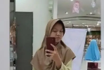

<!-- Profile Picture -->

  

<h1 align="center">✨ Hello, I'm Nisa Azki ✨</h1>
<h3 align="center">🌸 Passionate about Creativity, Technology, and Learning 🌸</h3>

---

## 🌟 About Me  
Hi there! 👋  
I’m **Nisa Azki**, a curious learner who loves exploring the world of **Web & App Design, Conflict Mediation, UI/UX, E-Learning, and Travelling**.  
I enjoy discovering new things in the IT world 💻, and I truly value meaningful friendships 🤝.  
Let’s grow and create together! 🚀  

---

## 📊 GitHub Stats & Activity

    

    
    

    

    

---

## 💻 Tech Stack  

  <!-- improvisasi stack sesuai minat kamu -->
  
  
  
  
  
  

---

## 🚀 Top Projects  

  

---

## 📈 Contributions & Activity  

  

---

## 🏆 Achievements  

  

---

## 🌐 Connect With Me  

  

---

✨ Thank you for visiting my profile ✨

